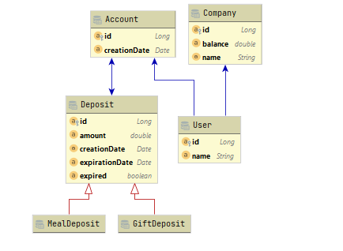
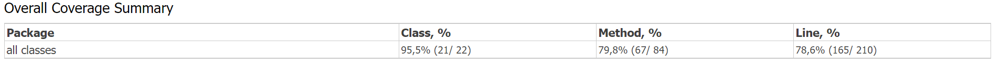

# Wedoogift Backend challenge
You are interested in joining our team ? try to accomplish this challenge, we will be glad to see
your code and give you feedback.

## Guidelines
* Use Java to accomplish this challenge.
* Clone this repo (do not fork it)
* Only do one commit per level and include the `.git` when submitting your test
* We are not expecting any user interface for this challenge. 

## Evaluation
We will look at:
* How you use OOP.
* Your code quality.
* The design patterns you use.
* Your ability to use unit tests.


## Statements

Companies can use Wedoogift services to distribute:
- Gift deposits
- Meal deposits
### Gift deposits
Gift deposits has 365 days lifespan, beyond this period it will no longer be counted in the user's balance.

example:
John receives a Gift distribution with the amount of $100 euros from Tesla. he will therefore have $100 in gift cards in his account.
He received it on 06/15/2021. The gift distribution will expire on 06/14/2022. 
### Meal deposits
Meal deposit works like the Gift deposit excepting for the end date. In fact meal deposits expires at the end of February of the year following the distribution date.

example:
Jessica receives a Meal distribution from Apple with the amount of $50 on 01/01/2020, the distribution ends on 02/28/2021.

* Implement one or two functions allowing companies to distribute gift and meal deposits to a user if the company balance allows it.
* Implement a function to calculate the user's balance.

### Solution
* Entity relationship diagram :


* I supposed that each user can have only one account.
* Abstract class deposit entity. 
* for each deposit type we can create a child class (expandable). 
* I used the pattern design Factory to create deposit.
* I used Jpa Repository for the Java Persistence.
* I used H2 database in memory for dev test.
* I used @Lock annotation to enable transaction lock for critical treatments ( update balance)
* I used interfaces and implementation for business layer.
* I added a createFakeData class to create data for dev test.
* I used a basic exception handling.
* I added two controller in the web layer to expose a rest service.
* I used a scheduled task to update expired deposit and company balance.
* I assumed that it is necessary to credit the account of the company when the deposit is expired.
* I added 14 unit test.



####install 
mvn clean install

####run
java -jar target/*.jar

####Application test
* Get user balance example :

```
curl --location --request GET 'http://localhost:8082/wedoogift/api/users/getBalance/1'

```  
* Add deposit :

```
curl --location --request POST 'http://localhost:8082/wedoogift/api/deposits' \
--header 'Content-Type: application/json' \
--data-raw '{
  
        "accountId": "3",
        "companyId": "2",
        "amount": "90",
        "type": "MEAL"
   
}'
``` 
####We can add : 
* Security layer : spring security 
* AOP Loggin
* DTO and mapstruct
* Operation History to save and audit all deposit actions.
* we can improve error handling
* profile management
* liquibase for database
* dockerize application
